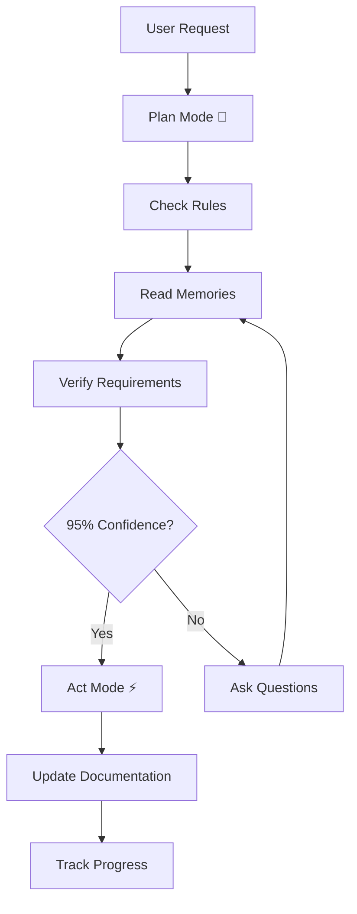

# 🛠️ ContextForge CLI

## 🌟 Quick Overview
A powerful CLI tool for managing and enhancing AI context in your projects. ContextForge CLI provides advanced context management, memory systems, and automated documentation capabilities through a dual-mode operation system (Plan/Act) with confidence scoring.

## 🔄 Core System
1. **Memory System** (`@memories.md`)
   - Tracks all interactions and their outcomes
   - Updates automatically with each operation
   - Maintains project context through intelligent linking
   - Cross-references related information using semantic matching
   - Builds confidence scoring through historical analysis
   - Provides context-aware suggestions based on past interactions

2. **Lessons Learned** (`@lessons-learned.md`)
   - Captures solutions and their effectiveness
   - Documents best practices with confidence ratings
   - Prevents repeated issues through pattern recognition
   - Improves system intelligence via feedback loops
   - Maintains a knowledge base of successful strategies
   - Links solutions to specific context scenarios

3. **Scratchpad** (`@scratchpad.md`)
   - Manages current phase with confidence tracking
   - Tracks implementation progress and blockers
   - Monitors confidence scores in real-time
   - Guides development flow based on context
   - Records decision points and rationale
   - Facilitates mode transitions based on confidence

## 🎯 How It Works



## 🚀 Core Features
1. **Context Management**
   - Intelligent context tracking with memory system
   - Automated documentation updates
   - Cross-referencing between components
   - Real-time context verification

2. **AI Integration**
   - LangChain integration for advanced processing
   - LangGraph workflows for complex operations
   - Advanced prompt engineering
   - Confidence-based decision making

3. **Development Tools**
   - Automated testing and validation
   - Documentation generation and maintenance
   - Code analysis with context awareness
   - Performance monitoring

## 💡 Mode System
1. **Plan Mode** 🎯
   ```
   - System reads: @memories.md, @lessons-learned.md
   - Checks: project requirements and constraints
   - Builds: confidence score through multiple factors:
     * Historical success rate
     * Context relevance
     * Pattern matching accuracy
     * Requirement coverage
   - Verifies: implementation path using cross-references
   - Requires: 95% confidence to transition to Act Mode
   ```

2. **Act Mode** ⚡
   ```
   - Triggers at 95% confidence threshold
   - Implements solutions with continuous validation
   - Updates documentation with cross-references
   - Tracks progress and maintains confidence scoring
   - Updates memory system with new interactions
   - Records success/failure metrics for future reference
   ```

### 🎯 Confidence Scoring System
The system uses a multi-factor approach to calculate confidence:

1. **Historical Analysis** (30%)
   - Past success rate in similar contexts
   - Pattern matching with known solutions
   - Error rate in similar scenarios

2. **Context Relevance** (30%)
   - Current context match percentage
   - Cross-reference accuracy
   - Requirement coverage

3. **Implementation Confidence** (40%)
   - Code analysis confidence
   - Test coverage assessment
   - Documentation completeness
   - Resource availability

### 🔄 Cross-Reference System
The system maintains context through intelligent cross-referencing:

1. **Semantic Linking**
   - Connects related concepts and solutions
   - Maps dependencies between components
   - Tracks impact of changes

2. **Context Mapping**
   - Links requirements to implementations
   - Connects issues to solutions
   - Maps user interactions to outcomes

3. **Knowledge Graph**
   - Builds relationships between concepts
   - Identifies patterns in solutions
   - Suggests optimizations based on context

## 🔧 Installation

```bash
# Using UV (recommended)
uv pip install contextforge-cli

# Using pip
pip install contextforge-cli
```

## 📘 Usage

```bash
# Initialize a new project
contextforge-cli init

# Generate documentation
contextforge-cli docs generate

# Analyze context
contextforge-cli analyze

# Check system confidence
contextforge-cli confidence check
```

## 🎯 Tips & Tricks

### 🔄 Handling AI Hallucinations & Cursor Issues
1. **Open Required Tabs**:
   ```
   1️⃣ Active file you're working on
   2️⃣ Cursor Settings (Feature tab → Resync Index)
   3️⃣ .cursorrules file (keep open for auto-reload)
   ```

2. **Reload Process**:
   ```
   1. Press Ctrl+Shift+P
   2. Type "Developer: Reload Window"
   3. Wait 3-10 seconds for complete reload
   ```

3. **Common Scenarios & Solutions**:

   a. **Low Confidence Scores**
   ```
   - Symptom: System stuck in Plan Mode
   - Solution:
     1. Check @memories.md for context gaps
     2. Update relevant documentation
     3. Verify cross-references
     4. Run confidence check command
   ```

   b. **Context Misalignment**
   ```
   - Symptom: AI responses seem out of context
   - Solution:
     1. Open all relevant files
     2. Update .cursorrules
     3. Reload window
     4. Verify memory system updates
   ```

   c. **Memory System Issues**
   ```
   - Symptom: Missing or outdated context
   - Solution:
     1. Check .cursor/ directory integrity
     2. Verify file permissions
     3. Run contextforge-cli analyze
     4. Update cross-references
   ```

   d. **Mode Transition Failures**
   ```
   - Symptom: Stuck between Plan/Act modes
   - Solution:
     1. Check confidence scores
     2. Verify requirement coverage
     3. Update scratchpad
     4. Run confidence check
   ```

4. **When to Use**:
   - AI seems confused or unresponsive
   - Cursor not working properly
   - Unexpected behavior
   - Need to refresh codebase indexing
   - Confidence scores are inconsistent
   - Cross-references seem incorrect

### 💡 Best Practices
- Keep memory files up to date
- Maintain high confidence scores through regular validation
- Document all significant changes with proper cross-references
- Use proper mode transitions based on confidence thresholds
- Follow documentation standards for consistency
- Regularly verify cross-reference integrity
- Monitor confidence scoring trends
- Update lessons learned after significant events

## 🔍 Directory Structure
```
.
├── src/
│   └── contextforge_cli/          # Main package
│       ├── __init__.py
│       ├── __main__.py
│       ├── cli.py                 # CLI entry point
│       ├── constants.py           # Global constants
│       ├── types.py              # Type definitions
│       ├── aio_settings.py       # Async settings
│       ├── bot_logger/           # Logging components
│       │   ├── __init__.py
│       │   └── logger.py
│       ├── models/               # Data models
│       │   ├── __init__.py
│       │   ├── config.py
│       │   └── state.py
│       ├── shell/               # Shell interaction
│       │   ├── __init__.py
│       │   └── console.py
│       ├── subcommands/         # CLI subcommands
│       │   ├── __init__.py
│       │   ├── ai_docs_cmd.py
│       │   └── analyze_cmd.py
│       └── utils/               # Utility functions
│           ├── __init__.py
│           ├── ai_docs_utils.py
│           └── file_utils.py
├── tests/                       # Test suite
│   ├── __init__.py
│   ├── conftest.py             # Test fixtures
│   ├── unittests/             # Unit tests
│   │   ├── __init__.py
│   │   ├── test_cli.py
│   │   └── test_utils.py
│   └── integration/           # Integration tests
│       ├── __init__.py
│       └── test_commands.py
├── docs/                      # Documentation
│   ├── README.md             # Documentation index
│   ├── api/                  # API documentation
│   │   └── README.md
│   ├── guides/              # User guides
│   │   ├── getting-started.md
│   │   └── advanced-usage.md
│   └── troubleshooting.md   # Troubleshooting guide
├── examples/                 # Usage examples
│   ├── README.md
│   └── basic_usage.py
├── scripts/                 # Utility scripts
│   └── update_docs.py
├── .cursor/                 # System memory
│   ├── memories.md         # Interaction history
│   ├── lessons-learned.md  # Solutions & practices
│   ├── scratchpad.md      # Current phase tracking
│   └── rules/             # System rules
│       ├── general.rules
│       └── python.rules
├── .github/                # GitHub configuration
│   ├── workflows/         # GitHub Actions
│   │   └── tests.yml
│   └── ISSUE_TEMPLATE/
├── pyproject.toml         # Project configuration
├── uv.lock               # UV lock file
├── .pre-commit-config.yaml # Pre-commit hooks
├── .ruff.toml           # Ruff configuration
├── .gitignore
├── LICENSE
├── README.md
└── CONTRIBUTING.md
```

## 🛠️ Development Setup

1. **Clone the repository**
   ```bash
   git clone https://github.com/yourusername/contextforge-cli.git
   cd contextforge-cli
   ```

2. **Install dependencies**
   ```bash
   uv sync
   ```

3. **Run tests**
   ```bash
   uv run pytest
   ```

## 🤝 Contributing

We welcome contributions! Please see our [Contributing Guidelines](CONTRIBUTING.md) for details on:
- Code style and standards
- Testing requirements
- Pull request process
- Development workflow
- Documentation guidelines

## 📝 License

MIT License - See [LICENSE](LICENSE) for details.

---

*Built with ❤️ using Python, LangChain, and LangGraph*

## 🔍 Additional Resources
- [Documentation](docs/README.md)
- [API Reference](docs/api/README.md)
- [Examples](examples/README.md)
- [Troubleshooting Guide](docs/troubleshooting.md)
